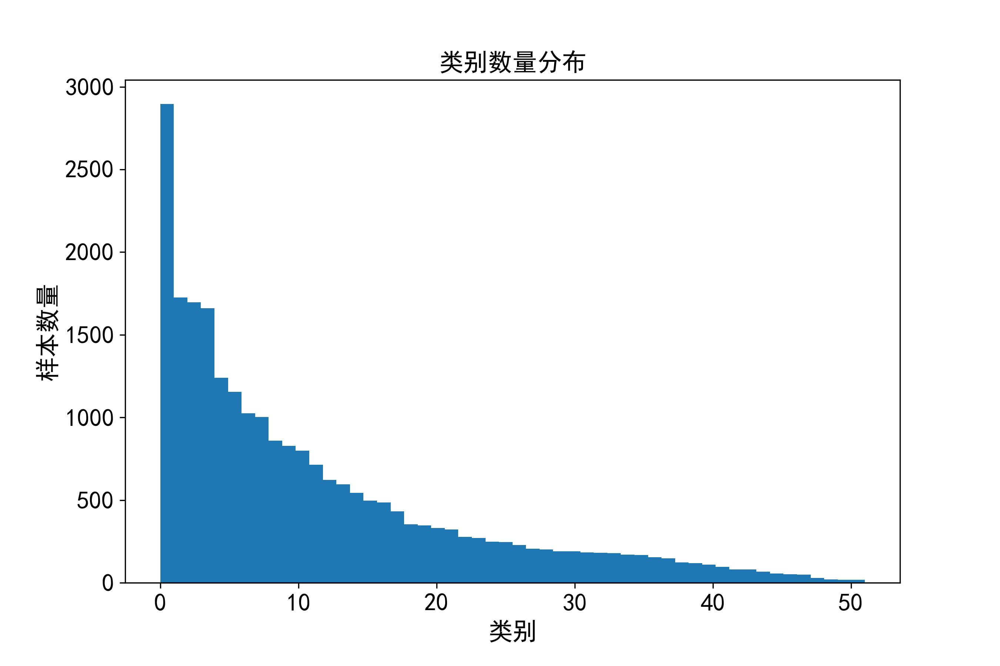
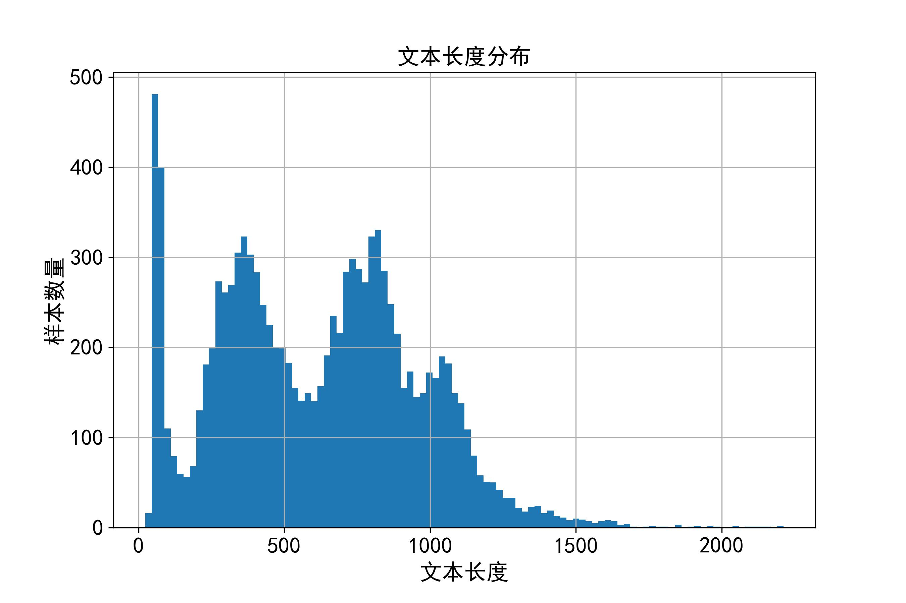
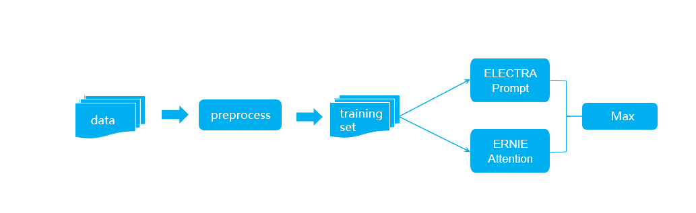
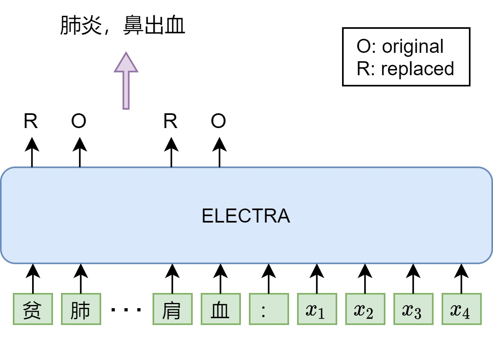
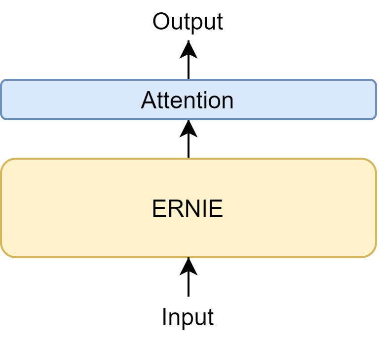
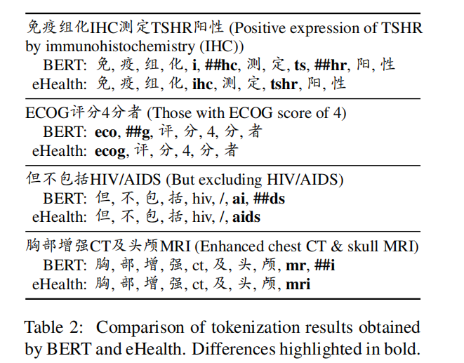

## 苏州园区“华为云杯”2022人工智能创新应用大赛（创客）总结

#### 1 赛题

##### 1.1 背景

近年来，为了合理配置医疗资源、促进基本医疗卫生服务均等化，各地积极推进分级诊疗制度，引导优质医疗资源下沉。然而，基层医疗机构面临医生经验不足、诊疗不规范等问题。为此，提升基层医疗诊疗水平，提高诊疗质量迫在眉睫。电子病历（EMR）是病人在医院诊断治疗全过程的原始记录，是医疗机构在医疗信息化建设过程中形成的重要数字资产，也是AI技术进入医院的数据基础。随着AI技术的快速发展，利用自然语言处理、知识图谱等AI技术，以电子病历为处理对象构建的辅助诊断系统，有望为基层医生提供可靠的临床诊断参考。AI与临床诊断的结合，是医疗智能化建设的必然选择，也是解决民生关切的重要途径。

##### 1.2 赛题说明

本赛题是利用病人电子病历文本信息推断出其可能患有疾病的疾病诊断任务。电子病历文本信息主要包括病人的性别、年龄、主诉、现病史、既往史、体格检查和辅助检查。标签信息为病人的出院诊断疾病。本赛题任务需要根据病人的电子病历文本信息推断出病人所患有的全部疾病。（注：病人的出院诊断疾病并不是单一的）

##### 1.3 数据说明

数据集训练集包含11068份电子病历，涉及到52种疾病。具体类别如下：

| **科室**            | **疾病名称**                                                 |
| :------------------ | ------------------------------------------------------------ |
| 内科（25种）        | 高血压、冠状动脉粥样硬化性心脏病、先天性心脏病、心肌炎、脑卒中、支气管炎、肺炎、肺气肿、急性上呼吸道感染、腹泻、胃肠炎、胆囊炎、泌尿道感染、急性肾小球肾炎、糖尿病、贫血、短暂性脑缺血发作、带状疱疹、肺结核、慢性肺源性心脏病、高脂血症、皮炎、结肠炎、偏头痛、眩晕综合征 |
| 外科（15种）        | 阑尾炎、腹痛、胆管结石、腹股沟疝、肛周脓肿、前列腺增生、骨折、腰肌劳损、腰椎间盘突出、关节炎、痔、椎动脉型颈椎病、便秘、泌尿系结石、肩周炎 |
| 妇产科（2种）       | 子宫内膜炎、输卵管炎                                         |
| 眼、耳鼻喉科（9种） | 急性鼻窦炎、鼻出血、急性扁桃体炎、急性咽喉炎、急性咽炎、疱疹性咽峡炎、中耳炎、结膜炎、急性鼻咽炎 |
| 口腔科（1种）       | 口腔炎                                                       |

数据集格式为json格式，记录详细的电子病历信息，样例如下：

​    {

​     "emr_id": "ZY000542"

​     "age": "男",

​     "gender": "7岁",

​       "chief_complaint": "听力下降1月，伴咽痛3天",

​     "history_of_present_illness": "1月前无明显诱因发现患儿听力下降，感双耳闷塞，无畏寒、发热，无咳嗽、咳痰，无耳痛、耳道流血、流液情况，未予重视；3天前无明显诱因出现咽部疼痛，吞咽时明显，伴发热，体温为39.0℃，予口服布洛芬降温治疗后体温可正常，无恶心、呕吐及吞咽困难，无胸闷、气促及呼吸困难，无头昏、头痛，无昏迷、意识障碍等不适。门诊已“双耳渗出性中耳炎”收入我科，病后精神、饮食、睡眠可，二便如常，体重无明显增减。",

​     "past_history": "健康情况：既往体健。患病情况：否认“肝炎、伤寒、结核”病史，否认外伤史及输血史。药物及食物过敏情况：无。",

​     "physical_examination": "发育正常，营养中等，步入病房，自动体位，神志清楚，检查欠合作；全身皮肤粘膜无黄染、皮疹及出血点，各浅表淋巴结未扪及肿大；头颅外观无畸形，颈软，气管居中，甲状腺不大；双肺呼吸音清，未闻及干湿啰音；心界不大，心音有力，律齐，未闻及病理性杂音；腹部平、软，无压痛、反跳痛及肌紧张，肝、脾未扪及，移动性浊音（-），肠鸣音正常；肛门及外生殖器未查；脊柱四肢无畸形；神经系统生理反射存在，病理反射未引出。",

​     "supplementary_examination": "耳内窥镜检查示：双耳渗出性中耳炎。",

​     "diagnosis": [

​               "非化脓性中耳炎",

​               "急性扁桃体炎"

​                ]

   }

数据说明：

  emr_id：电子病历唯一编号

  age：年龄

  gender：性别

  chief_complaint：主诉

  history_of_present_illness：现病史

  past_history：既往史

  physical_examination：体格检查

  supplementary_examination：辅助检查

  diagnosis：出院诊断

 （注：若数据中某一字段不存在则采用空字符串进行表示。）

##### 1.4 评分标准

本赛题采用macro F1作为评价指标。

对于每一个预测的疾病有真阳性（True Positive，TP），假阳性（False Positive，FP），假阴性（False Negative），真阴性（True Negative），n表示n种疾病。


#### 2 数据分析

##### 2.1 类别样本个数




存在数据分布不均，长尾分布的特点，部分类别样本数极少

##### 2.2 样本长度分布




年龄+性别+主诉+现病史+辅助检查+体格检查+既往史

多数样本长度在1500以内

#### 3 方法

##### 3.1 模型总览




原始数据通过去除空格等预处理得到训练集，然后分别通过ELECTRA-Prompt和ERNIE-Attention模型得到每个疾病对应的概率，最后通过取最大概率进行融合。

##### 3.2 ELECTRA-Prompt



模型：chinese-electra-180g-base-discriminator

输入：4*440

不同的多标签分类建模方式

少样本

模型多样性

1. 每个疾病选取一个字代表这个疾病，按照标号拼接起来，得到label表示序列
2. 将该序列与原始输入进行拼接
3. 模型预测每个label对应的位置是O还是R，如果是原始的认为识别出该疾病，否则未识别出

##### 3.3 ERNIE-Attention



模型：ernie-health-zh

输入：4*445

Attention：最后四层embedding拼接后做attention，每层得到一个表示，将这四个表示与每层的cls做拼接，再通过全连接层得到最后的分类结果

ERNIE-health：使用医疗领域的词典从头开始训练的预训练模型，分词更加合理。不同于ELECTRA，RTD(replaced token detection)过于简单，为了增强语言模型的能力，增加了MTS(multi-token selection)任务（尝试恢复被替换的token，从候选token中进行选择）和句子级别判别CSP(contrastive sequence prediction)



#### 4 微调手段

##### 4.1 模型融合

防止单模型过拟合，采用多模型融合

##### 4.2 伪标签

1.从30-50岁以及未登记年纪的患者中随机选取2个样本（男女分别选取）

2.拼接样本并设置年龄为空

3.按照标点分割，并随机选取60%的句子作为新样本

4.利用训练好的模型生成新的疾病诊断

未登记的样本个数很多。此外还可以考虑按照不同年龄段进行依次伪标签生成。

##### 4.3 对抗训练

[参考](https://zhuanlan.zhihu.com/p/91269728)

对抗训练通过添加**扰动**构造一些对抗样本，放给模型去训练，**以攻为守**，提高模型在遇到对抗样本时的鲁棒性，同时一定程度也能提高模型的表现和泛化能力。

好的对抗样本一般具有两个特点：

1. 相对于原始输入，添加的扰动是小的
2. 能使模型犯错

下图是对抗样本的一个例子


对抗训练就是在原始输入样本 $x$ 上添加一个扰动 $r_{adv}$ ，得到对抗样本后，用其进行训练。可以抽象成下面的模型。

$min_{\theta}-logP(y|x+r_{adv};\theta)$

GAN之父Ian Goodfellow认为**神经网络由于其线性的特点，很容易受到线性扰动的攻击**。于是提出了Fast Gradient Sign Method (FGSM)来计算输入样本扰动。扰动定义为：$r_{adv}=\epsilon \cdot sgn(\nabla_x L(\theta,x,y))$

这个扰动的思想可以理解成将输入样本向着损失上升的方向再进一步，得到的对抗样本就能造成更大的损失，提高模型的错误率。

##### Min-Max公式

$min_{\theta}\mathbb{E}_{(x,y)\sim D}[max_{r_{adv}\in S}L(\theta,x+r_{adv},y)]$

该公式分为两个部分，一个是内部损失函数的最大化，一个是外部经验风险的最小化。

1. 内部max是为了找到worst-case的扰动，也就是攻击，其中， L 为损失函数， S 为扰动的范围空间。
2. 外部min是为了基于该攻击方式，找到最鲁棒的模型参数，也就是防御，其中 D 是输入样本的分布。

##### CV到NLP

CV任务的输入是连续的RGB的值，而NLP问题中，输入是离散的单词序列，一般以one-hot vector的形式呈现，如果直接在raw text上进行扰动，那么扰动的大小和方向可能都没什么意义。

Goodfellow在17年的ICLR中 提出了可以在连续的embedding上做扰动。乍一思考，觉得这个解决方案似乎特别完美。然而，对比图像领域中直接在原始输入加扰动的做法，在embedding上加扰动会带来这么一个问题：这个被构造出来的“对抗样本”并不能map到某个单词，因此，反过来在inference的时候，对手也没有办法通过修改原始输入得到这样的对抗样本。我们在上面提到，对抗训练有两个作用，一是提高模型对恶意攻击的鲁棒性，二是提高模型的泛化能力。在CV任务，根据经验性的结论，对抗训练往往会使得模型在非对抗样本上的表现变差，然而神奇的是，在NLP任务中，模型的泛化能力反而变强了。因此，**在NLP任务中，对抗训练的角色不再是为了防御基于梯度的恶意攻击，反而更多的是作为一种regularization，提高模型的泛化能力**。

##### 对抗训练代码

###### a Fast Gradient Method (FGM)

假设输入的文本序列的embedding vectors $[v_1,v_2,...,v_T]$ 为 $x$ ，embedding的扰动为：

$r_{adv}=\epsilon⋅g/||g||_2$

$g=\nabla_xL(θ,x,y)$

```python
import torch
class FGM():
    def __init__(self, model):
        self.model = model
        self.backup = {}

    def attack(self, epsilon=1., emb_name='emb.'):
        # emb_name这个参数要换成你模型中embedding的参数名
        for name, param in self.model.named_parameters():
            if param.requires_grad and emb_name in name:
                self.backup[name] = param.data.clone()
                norm = torch.norm(param.grad)
                if norm != 0 and not torch.isnan(norm):
                    r_at = epsilon * param.grad / norm
                    param.data.add_(r_at)

    def restore(self, emb_name='emb.'):
        # emb_name这个参数要换成你模型中embedding的参数名
        for name, param in self.model.named_parameters():
            if param.requires_grad and emb_name in name: 
                assert name in self.backup
                param.data = self.backup[name]
        self.backup = {}
```

需要使用对抗训练的时候，只需要添加五行代码：

```python
# 初始化
fgm = FGM(model)
for batch_input, batch_label in data:
    # 正常训练
    loss = model(batch_input, batch_label)
    loss.backward() # 反向传播，得到正常的grad
    # 对抗训练
    fgm.attack() # 在embedding上添加对抗扰动
    loss_adv = model(batch_input, batch_label)
    loss_adv.backward() # 反向传播，并在正常的grad基础上，累加对抗训练的梯度
    fgm.restore() # 恢复embedding参数
    # 梯度下降，更新参数
    optimizer.step()
    model.zero_grad()
```

###### b Projected Gradient Descent（PGD）

[PGD](https://zhuanlan.zhihu.com/p/91269728)

不同于FGM的一步到位，PGD采用小步走，多走几步

在实验中，作者发现，经过PGD训练过的模型，对于所有的一阶对抗都能得到一个低且集中的损失值

#### 5 实验结果

| 模型                                 | 得分   |
| ------------------------------------ | ------ |
| ERNIE_attention                      | 0.6172 |
| ERNIE_attention + pseudo_label       | 0.6299 |
| ERNIE_attention +  FGM               | 0.6409 |
| ELECTRA_prompt                       | 0.6138 |
| ELECTRA_prompt +  FGM + pseudo_label | 0.6350 |
| Fusion                               | 0.6711 |

#### 6 其他尝试

##### 6.1 label-sentence attention

将长文本切分成句子，构建label-sentence attention，最后将attention后的label表示与原始的label表示做相似度计算，全连接层也试过

##### 6.2 利用标签的共现关系和图网络获取标签之间的联系

